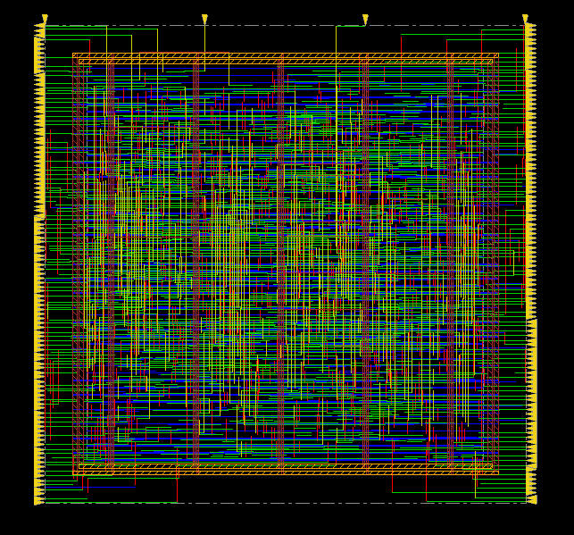

# AHB-to-APB Bridge — RTL to GDSII (Asynchronous CDC Bridge)

A dual-clock AHB-Lite → APB bridge, taken from RTL through synthesis,
place & route, and GDSII stream-out. `HCLK` and `PCLK` are treated as
genuinely independent clocks (different PLLs, unrelated frequency and
phase) — the whole point of this design is the clock-domain-crossing
(CDC) boundary, not just the protocol bridging.

## Architecture

The single AHB/APB FSM you'd use for a same-clock bridge is split into
two independent FSMs, one per clock domain, connected by a pair of
Gray-code asynchronous FIFOs:

```
 HCLK domain                          PCLK domain
┌───────────────┐    async_fifo    ┌───────────────┐
│  ahb_req_fsm   │ ───────────────▶ │  apb_req_fsm   │
│ (AHB-Lite      │    (TX, 2-flop   │ (APB SETUP/    │
│  slave side)   │     sync'd)      │  ACCESS master)│
│                │ ◀─────────────── │                │
└───────────────┘    async_fifo    └───────────────┘
                      (RX, 2-flop
                       sync'd)
```

- **`ahb_req_fsm`** (HCLK) accepts an AHB transfer, packages it into a
  request, and pushes it into the TX FIFO.
- **`apb_req_fsm`** (PCLK) pops the request, runs the APB
  SETUP/ACCESS handshake against the peripheral, and pushes the
  response into the RX FIFO.
- **`ahb_req_fsm`** pops the response and completes the AHB transfer.
- **`async_fifo`** — the CDC-safe piece: binary + Gray-coded
  read/write pointers, each synchronized into the other clock domain
  with a 2-flop synchronizer. Gray coding guarantees adjacent counts
  differ by exactly one bit, so a synchronizer sampling mid-transition
  can only ever resolve to the old or new pointer value, never a bogus
  in-between code.
- **`reset_sync`** — both incoming resets are treated as possibly
  asynchronous and locally resynchronized to their own clock domain.
- **`addr_decoder`** — maps `HADDR` to one of `NUM_SLAVES` APB
  peripheral select lines.

Externally, the bridge looks like a standard AHB-Lite slave port and a
scalar APB master port (`PADDR`/`PSEL`/`PENABLE`/`PWRITE`/`PWDATA`,
muxed by the caller across peripherals).

## Verification

Self-checking testbench (`tb/tb_ahb2apb_async.sv`): directed + randomized
transactions, scoreboard-checked, with `HCLK`/`PCLK` driven at
deliberately unrelated periods and an offset start — specifically to
exercise the CDC boundary rather than let a convenient clock ratio hide
a synchronization bug.

```
TEST SUMMARY: 170 transactions, 0 errors
HCLK period=10.00ns  PCLK period=4.70ns  (independent clocks)
RESULT: PASS
```

Run with Synopsys VCS 2023.03; waveform debug via Verdi
(`sim/vcs/verdi_config_file`).

## Synthesis (Cadence Genus 21.14)

Target library: `gpdk045` / `gsclib045` (Cadence generic 45 nm PDK).
Constraints: `HCLK` = 4.0 ns (250 MHz), `PCLK` = 10.0 ns (100 MHz),
`set_clock_groups -asynchronous` between the two domains.

| Metric | Result |
|---|---|
| Cell count | 1,077 |
| Total area | ~6,962 µm² (5,603.7 µm² cells + 1,358.6 µm² net, physical library estimate) |
| Cell mix | 80.7% sequential area (575 flops — mostly `SDFFQX1`×392, `DFFRHQX2`×97, `SDFFRHQX1`×74), 17.8% combinational logic, 1.5% inverters |
| Total power | ~1.41 mW (Genus vectorless estimate) |
| `check_design` | 0 unresolved refs, 0 undriven/multidriven nets, no inferred latches |
| `check_timing_intent` (lint) | 0 real design issues — remaining flags are benign (108 primary inputs with no external driver model yet, `HRESETn`/`PRESETn` correctly unconstrained as clocked delays) |

The flop-heavy cell mix (80.7% of area) tracks with the design being
almost entirely FSM + FIFO control logic, which is also why placement
and routing (below) had little congestion to fight.

## Place & Route (Cadence Innovus 21.15)

Post-CTS hold check showed small negative slack (down to ‑17 ps) on a
handful of reset-recovery/removal and synchronizer-pointer paths —
expected at that stage, since CTS only does a first pass with
estimated parasitics. `optDesign -postRoute -setup -hold` (run with
real extracted parasitics after routing) closed it:

| | WNS | TNS | Violating paths |
|---|---|---|---|
| Setup | **+1.022 ns** | 0.000 ns | 0 / 1,776 |
| Hold | **+0.004 ns** | 0.000 ns | 0 / 1,776 |

Placement: all 1,077 instances placed, 0 unplaced, 64.97% placement
density (5,604/8,625 sites) — right in the ~65% starting-utilization
range this small a control block would target.

Routing / signoff checks, all clean:
- `verify_drc` — no DRC violations
- `verify_connectivity` (full-design + VDD/VSS special nets) — no
  problems or warnings
- `verifyPowerVia` — no problems or warnings (power/ground via stack
  intact)
- `report_route -summary` — 1,231 instances, 1,351 nets, 0 shorts/opens,
  32,914.5 µm total wirelength, 7,343 vias
- GDSII streamed out: `pnr/outputs/ahb2apb_bridge_async.gds`



## Repo layout

```
rtl/async/       RTL sources (bridge, both FSMs, async FIFO, reset sync, addr decoder)
tb/              Self-checking testbench + shared APB peripheral model
filelists/       VCS/Genus-style file lists (.f)
constraints/     SDC timing constraints
sim/vcs/         VCS compile + run scripts, sim logs, Verdi config
syn/scripts/     Genus synthesis scripts
syn/reports/     Genus reports (timing, area, power, gates, check_design)
syn/outputs/     Genus → Innovus handoff (netlist, SDC, library views)
pnr/scripts/     Innovus scripts: 01_init, 02_floorplan, 03_cts, 04_route_signoff
pnr/reports/     Innovus reports (timing, DRC, connectivity, route summary)
pnr/outputs/     Final netlist, SDF, and GDSII
docs/FLOW.md     Stage-by-stage walkthrough of the flow
```

## Reproducing

```bash
# 1. Simulate (VCS)
cd sim/vcs && ./run_vcs_async.sh
verdi -dbdir simv_async.daidir &

# 2. Synthesize (Genus) — set your PDK paths in syn/scripts/setup_genus.tcl first
cd ../../syn/scripts && genus -files run_genus.tcl -log ../reports/genus.log

# 3. Place & route (Innovus) — run interactively the first time through,
#    one stage at a time, so you can check each report before continuing
cd ../../pnr/scripts && innovus
# source 01_init.tcl
# source 02_floorplan.tcl
# source 03_cts.tcl
# source 04_route_signoff.tcl
```

See `docs/FLOW.md` for what to check at each stage.
